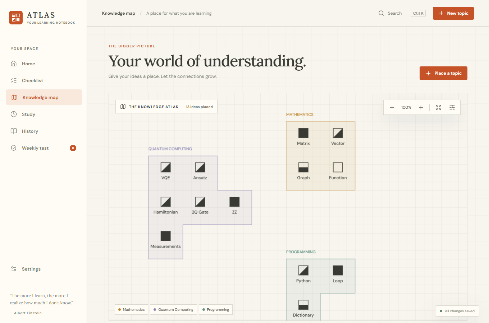
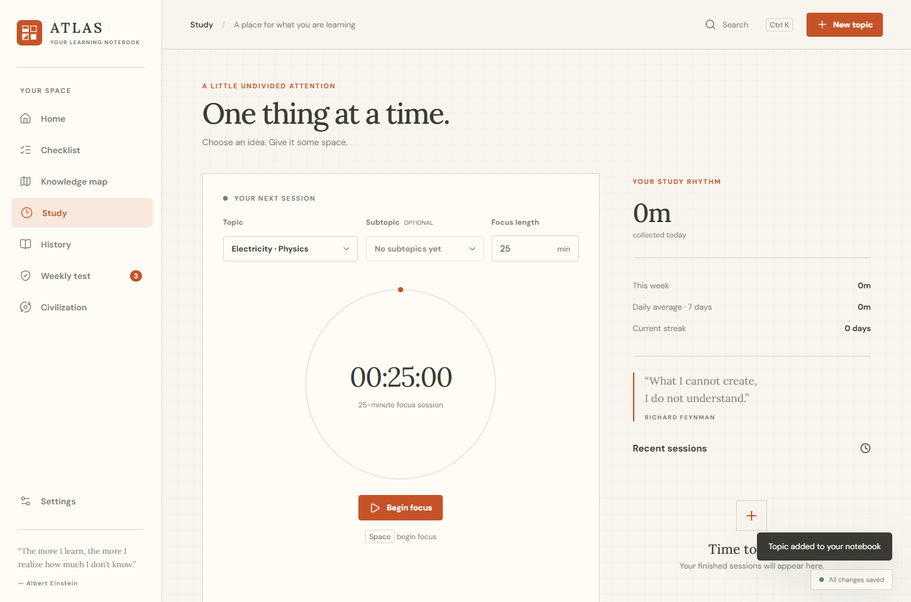
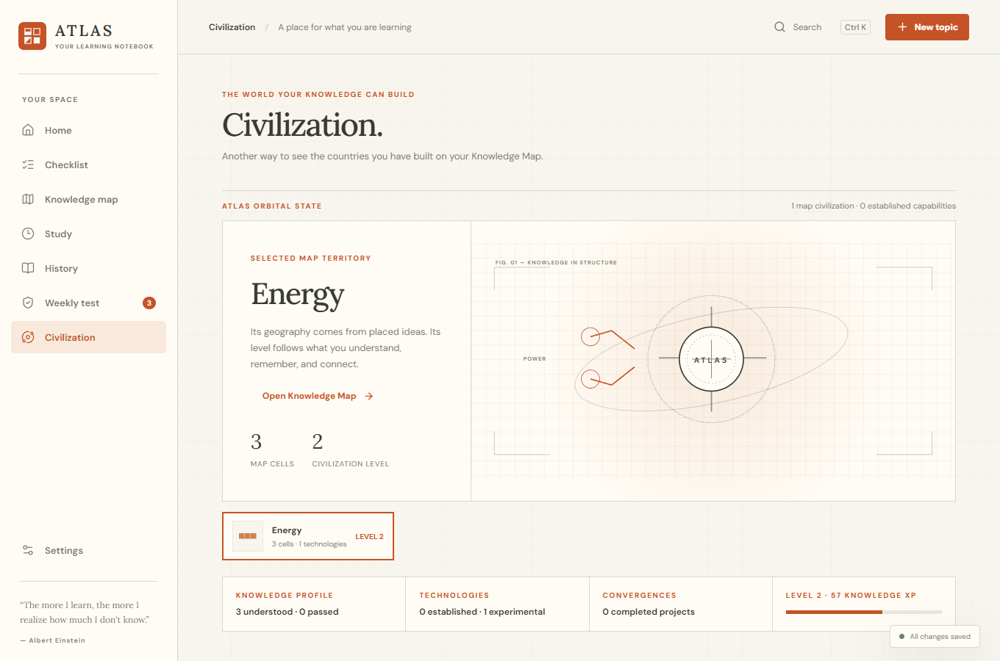

# ATLAS

### Adaptive Thinking, Learning, and Assessment System

[](https://github.com/radiumQCO/ATLAS-Adaptive-Thinking-Learning-Assessment-System/actions/workflows/ci.yml)
[](LICENSE)


I made ATLAS because my study notes kept becoming a pile of disconnected lists. I wanted one place where I could write down what I was learning, see how ideas connect, focus for a while, and check later whether I actually remembered anything.

It's a Windows desktop app, and it works offline. Your notebook stays on your computer. There's no account, cloud sync, or website to set up.



## What you can do

- **Build a real knowledge map.** Put topics into colored territories, connect ideas, move around the canvas, and zoom in or out.
- **Study with a countdown.** Pick a topic and a duration. The ring and marker move with your progress, and ATLAS plays a sound and shows a message when time is up.
- **Keep a useful checklist.** Add topics and subtopics, move them around, mark what you understand, and delete a topic straight from its row.
- **Test your memory.** Weekly reviews feed your learning history instead of just counting how many boxes you clicked.
- **Explore Civilization if you want.** Each territory on the Knowledge Map becomes its own civilization. Its size comes from placed map cells; its level comes from understanding, passed reviews, depth, capabilities, and projects made possible by your knowledge. It never blocks the rest of the notebook.
- **Keep control of your data.** Changes save locally. Backups are optional, limited to the newest 12, and created at most once every six hours after changes. You can export a JSON copy to another drive.

<table>
  <tr>
    <td></td>
    <td></td>
  </tr>
  <tr>
    <td align="center"><b>Study</b></td>
    <td align="center"><b>Civilization</b></td>
  </tr>
</table>

The screenshots use example topics. A new installation starts with an empty notebook.

## The idea behind Civilization

I don't want it to be a second game full of fake currency and buttons to grind. The interesting part is that the map you actually make for learning becomes the world you see in Civilization:

> More map cells = more territory. More understanding and connected knowledge = a more developed civilization.

You can completely ignore that tab and still use every study feature. If you do open it, it shows what your current knowledge could make possible and where the gaps are.

## Download

The Windows installer is on the [Releases page](https://github.com/radiumQCO/ATLAS-Adaptive-Thinking-Learning-Assessment-System/releases). ATLAS uses Microsoft Edge WebView2, which Windows normally already has.

For now, this is a **local Windows app**. There is no hosted web version or cross-device account system. Export your notebook to a separate drive if you want a copy that survives losing your computer.

## Run from source

You'll need Node.js 22, Rust with the MSVC toolchain, Visual Studio C++ Build Tools with the Windows SDK, and WebView2.

```powershell
npm ci
npm run desktop:dev
```

To make your own installer:

```powershell
npm run desktop:build
```

The installer is created under **src-tauri/target/release/bundle/nsis/**. The app saves its SQLite database in its local app data directory. **Settings → Data & backups → Export JSON** creates a portable copy; **Import JSON** can bring that copy into another installation.

## How it's put together

| Part                | What it does                                       |
| ------------------- | -------------------------------------------------- |
| React + TypeScript  | Screens and interactions                           |
| Canvas              | Zoomable Knowledge Map                             |
| Web Audio           | Small synthesized interface sounds                 |
| Tauri + Rust        | Windows desktop shell and local file access        |
| SQLite              | Notebook data on Windows                           |
| Dexie               | Browser storage for local UI development and tests |
| Vitest + Playwright | Logic and interface checks                         |

The source is split between **src/features/** for screens, **src/lib/** for learning logic, **src/app/store.ts** for app state, and **src-tauri/src/** for local desktop storage.

## Run the checks

```powershell
npm test
npm run build
npm run test:e2e
cargo test --manifest-path src-tauri/Cargo.toml
```

The browser tests use an installed Google Chrome. GitHub Actions runs the frontend checks on every push.

## Privacy and safety

ATLAS doesn't send your topics or progress to a server. Git ignores local databases, known backup filenames, environment files, build output, and my development notes. Please check **git status** before committing your own changes and never upload a personal JSON export.

If you find a bug or have an idea, open an issue. I especially want to hear about confusing interactions, data loss risks, and parts of the Knowledge Map that feel awkward.

This is my personal learning project, shaped through many iterations with Codex assistance. The product idea and direction are mine; the code is open so other people can study it, improve it, or build on it.

Licensed under [Apache License 2.0](LICENSE).
